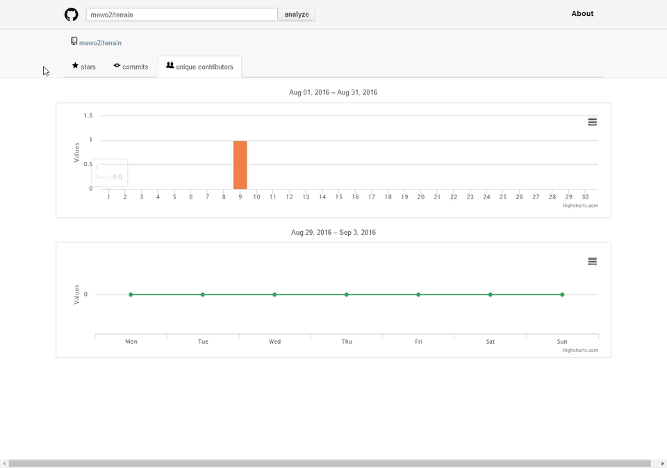

# analytics4github

  

[http://195.211.154.179](http://195.211.154.179)
Java web application to enhance github.com search mechanism.
Provided options facilitate search of new perspective projects    Preview changes
with good commits/stars/contributors grown.
Internally, the existed GitHub API is using.
To access a REST API documentation - run the application and access
 [http://195.211.154.179/swagger-ui.html](http://195.211.154.179/swagger-ui.html)
 
 

## Prerequisites

* JDK 1.8
* access to [GitHub REST API ](https://developer.github.com/v3/)
* access to [GitHub trending page](https://github.com/trending)
* Generate OAuth token for GitHub [https://github.com/settings/tokens](https://github.com/settings/tokens) and copy it to /var/token.txt or export to an environment variable GITHUB_TOKEN. 
* MongoDB 3.6 (docker run --name someMongo -p 27017:27017 mongo:3.6.0-jessie)

## Deployment
To run locally execute

     ./mvnw install -Dmaven.test.skip=true
      java -jar target/analytics4github*.jar 

accessible by default at http://127.0.0.1:8080

     
## Development

Tests stopped to work properly via maven but you can run them via Intellij
##### IntellijIdea

###### reload backend
To reload controllers after editing - press ctl + f9 and wait till application restart.
It'll execute "Make" and trigger hot-redeploy via spring-boot-devtools.

### working with frontend
adjust application.properties to use static resources from a file system, not a jar file. It will simplify frontend 
development

